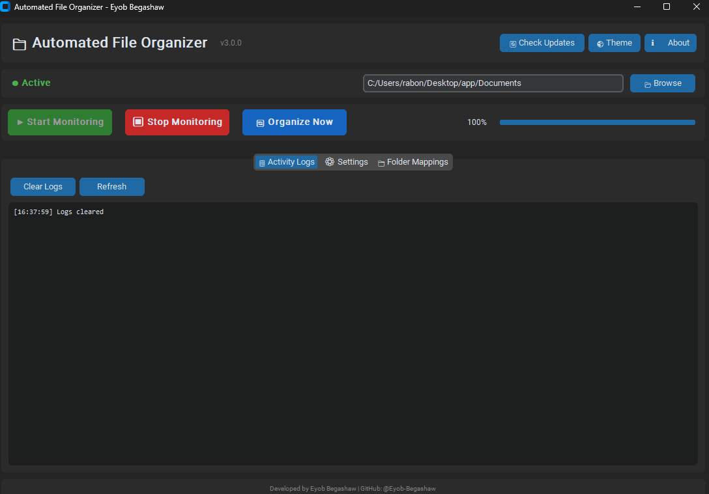
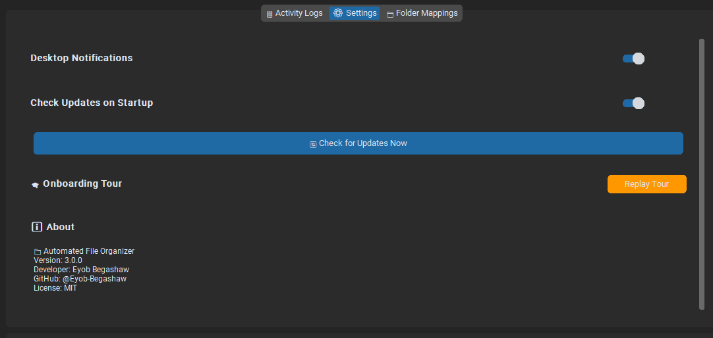

# 📁 Automated File Organizer

**One-click file organization for Windows!**

---

## 📥 Download & Install

### Quick Install (Recommended)
1. **Download** the latest `FileOrganizer_Setup.exe` from [Releases](https://github.com/eyobbegashaw/AutomatedFileOrganizer-Releases/releases/latest)
2. **Run** the installer
3. **Launch** from Desktop shortcut

### Portable Version
- Download `FileOrganizer.exe` (no installation needed)
- Run directly from any folder

---

## ✨ Features

| Feature | Description |
|---------|-------------|
| 🎯 Auto-Organization | Automatically sorts files into categorized folders |
| 📁 8+ Categories | Documents, Media, Archives, Coding & more |
| ⚡ Real-time Monitoring | Watches folders and organizes new files instantly |
| 🎨 Modern UI | Dark/Light theme with intuitive interface |
| 🔄 Auto-Update | Checks for updates automatically |
| 🎓 Onboarding Tour | Guided walkthrough for first-time users |
| 🔔 Notifications | Desktop alerts when files are organized |
| ⚙️ Customizable | Add your own folder mappings |

---

## 🚀 Quick Start

1. **Download** the setup file
2. **Install** with one click
3. **Select** folder to monitor (default: Downloads)
4. **Start** monitoring or click "Organize Now"

---

## 📸 Screenshots

*Main application window*

*Settings panel*

---

## 💻 System Requirements

- Windows 10/11 (64-bit)
- 256 MB RAM
- 50 MB free space

---

## 🔒 Privacy

- ✅ No data collection
- ✅ No internet required (except for updates)
- ✅ All files stay on your computer
- ✅ Open source (MIT License)

---

## 👨‍💻 Developer

**Eyob Begashaw**
- GitHub: [@eyobbegashaw](https://github.com/eyobbegashaw)

---

## 📄 License

MIT License - Free for personal and commercial use

---

[⬇️ Download Latest Version](https://github.com/eyobbegashaw/AutomatedFileOrganizer-Releases/releases/latest)
